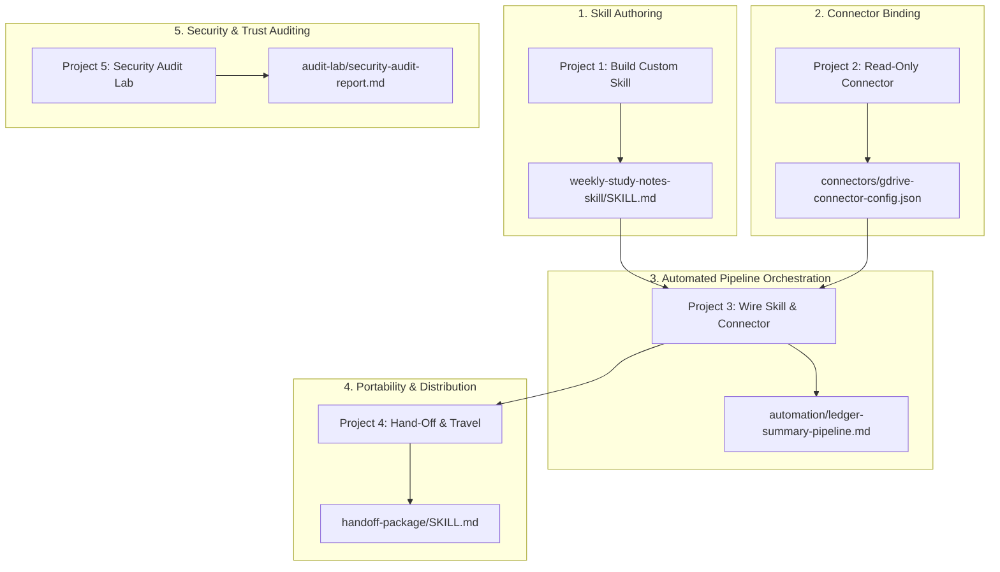

# Skills & Connectors — Hands-On Projects & Workflow Guide

Welcome to the **Skills & Connectors** project repository. This repository contains the complete hands-on project implementations, skill definition files (`SKILL.md`), connector configuration manifests, automated pipeline outputs, cross-tool verification logs, and security audit reports based on the official Panaversity *AI Agent Factory: Skills & Connectors* curriculum.

---

## 🔄 Project End-to-End Workflow Architecture

The repository follows a progressive 5-stage workflow designed to transition from authoring standalone AI skills to orchestrating live app data connectors and auditing third-party tools:



---

## 🗂️ Project Breakdown & Directory Navigation

### 1. Project 1: Build Your First Real Skill
- **Guide:** [`project-1-build-your-first-real-skill.md`](file:///d:/syeda%20Gulzar%20Bano/Skills%20And%20Connectors/project-1-build-your-first-real-skill.md)
- **Directory:** `weekly-study-notes-skill/`
- **Workflow:** Authors the `weekly-study-notes` skill using clarifying prompts, tunes natural-language description triggers, and validates zero-prompt execution on raw unformatted class notes.

### 2. Project 2: Connect One App, Read-Only, and Use It
- **Guide:** [`project-2-connect-one-app-read-only.md`](file:///d:/syeda%20Gulzar%20Bano/Skills%20And%20Connectors/project-2-connect-one-app-read-only.md)
- **Directory:** `connectors/`
- **Workflow:** Establishes Google Drive OAuth integration under strict read-only scope boundaries (`drive.readonly`), retrieving live data without manual uploads or copy-pasting.

### 3. Project 3: Wire a Skill and a Connector Together
- **Guide:** [`project-3-wire-skill-and-connector.md`](file:///d:/syeda%20Gulzar%20Bano/Skills%20And%20Connectors/project-3-wire-skill-and-connector.md)
- **Directory:** `automation/`
- **Workflow:** Combines live Google Drive connector retrieval and `weekly-study-notes` formatting into a single-sentence batch pipeline, verified via manual math spot-checks.

### 4. Project 4: Make It Portable, or Hand It Off
- **Guide:** [`project-4-portability-and-handoff.md`](file:///d:/syeda%20Gulzar%20Bano/Skills%20And%20Connectors/project-4-portability-and-handoff.md)
- **Directory:** `handoff-package/`
- **Workflow:** Decouples skill instructions into a redistributable `SKILL.md` package, verifying cold-start execution across secondary AI environments (Cowork, Claude Desktop).

### 5. Project 5: Audit a Skill Before You Trust It
- **Guide:** [`project-5-audit-skill-before-trust.md`](file:///d:/syeda%20Gulzar%20Bano/Skills%20And%20Connectors/project-5-audit-skill-before-trust.md)
- **Directory:** `audit-lab/`
- **Workflow:** Evaluates untrusted third-party community skills using a universal plain-language audit prompt, flagging hidden HTTP exfiltration endpoints and credential reading risks.

---

## 📂 Subdirectory Structure Map

```text
Skills And Connectors/
├── README.md                              # Main project workflow & overview
├── skills-connectors-projects.md         # Master index & system notes
├── skills-connectors-hands-on-projects-visual.pdf # Source project guide
├── project-1-build-your-first-real-skill.md
├── project-2-connect-one-app-read-only.md
├── project-3-wire-skill-and-connector.md
├── project-4-portability-and-handoff.md
├── project-5-audit-skill-before-trust.md
├── weekly-study-notes-skill/              # Project 1 skill container
│   ├── SKILL.md
│   ├── sample-input-notes.txt
│   └── sample-output-notes.md
├── connectors/                            # Project 2 connector specs & logs
│   ├── gdrive-connector-config.json
│   └── gdrive-execution-log.txt
├── automation/                            # Project 3 batch pipeline artifacts
│   ├── sample-ledger-data.csv
│   └── ledger-summary-pipeline.md
├── handoff-package/                       # Project 4 portable skill package
│   ├── SKILL.md
│   └── cross-tool-verification.md
└── audit-lab/                             # Project 5 security audit lab
    ├── third-party-skill-untrusted.md
    └── security-audit-report.md
```

---

## 🛠️ Environment & Prerequisites

- **AI Client Platform:** Claude Web App / Claude Desktop
- **Capabilities Required:** Code execution and file creation [ENABLED]
- **Connector Scopes:** Google Drive Read-Only (`https://www.googleapis.com/auth/drive.readonly`)
- **Author / Student:** Syeda Gulzar Bano