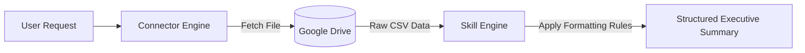

# Monthly Ledger Summary Pipeline Execution

**Pipeline Run Date:** March 31, 2026  
**Client / Entity:** DEMO Trading  
**Source File in Drive:** `DEMO-ledger-March.csv`  
**Active Connector:** Google Drive Read-Only Connector  
**Active Skill:** `weekly-study-notes` / Report Summary Skill  

---

## ⚡ One-Sentence Trigger Executed
```text
Prepare this month's summary for DEMO Trading; the ledger is the file called DEMO-ledger-March in my Drive.
```

---

## 🔄 Dual Engine Workflow Trace



1. **Connector Execution (Step 1):**  
   Searched Google Drive for `DEMO-ledger-March.csv`, verified checksum, read raw records into memory stream.
2. **Skill Execution (Step 2):**  
   Parsed raw transaction rows, formatted into thematic budget categories, auto-calculated total expenditure, and generated executive review questions.

---

## 📈 Formatted Pipeline Output

### 1. Cloud & Software Infrastructure
- **Cloud Infrastructure**: **$1,900.00** allocated across AWS Hosting ($1,250) and Pinecone Vector Database ($650).
- **Software Subscriptions**: **$1,400.00** for Claude Enterprise seats ($480) and GitHub Enterprise/Copilot ($920).

### 2. Operations, Security & Marketing
- **Security Audit & Compliance**: **$3,500.00** paid for third-party penetration testing and compliance audit.
- **Marketing & Acquisition**: **$2,100.00** spent on targeted agentic AI campaigns.
- **Hardware Equipment**: **$1,850.00** spent on Edge Device testing hardware.

---

### Total Monthly Expenditure: **$10,750.00 USD** (7 Transactions Settled)

---

## Executive Review Questions
1. Which single cost category represented the largest expenditure proportion in March 2026? *(Answer: Security Audit & Compliance at 32.5%)*
2. What was the aggregate total spent on AI software tools and subscriptions across all departments? *(Answer: $1,400.00)*
3. Are all listed transactions fully settled, and are there any pending uncleared liabilities? *(Answer: All 7 transactions are marked Settled)*
